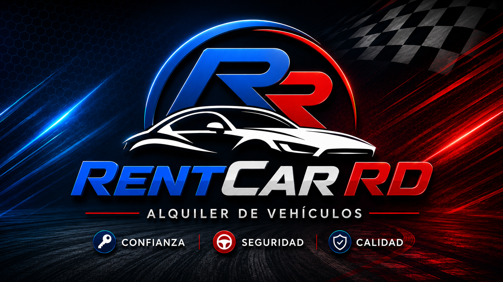

<p align="center">
  
</p>

<p align="center">
  
</p>

<p align="center">
  <strong>Aplicación web para administrar clientes, empleados, vehículos, inspecciones, rentas, devoluciones y reportes.</strong><br>
  Angular + ASP.NET Core Web API + Entity Framework Core + Microsoft SQL Server.
</p>

<p align="center">
  
  
  
  
</p>

## 🧊 Estado final — v1.2 Portfolio Edition

**RentCarRD está finalizado.** La versión **1.2** representa el cierre técnico del proyecto académico y su edición definitiva para portafolio.

A partir de esta versión el alcance funcional queda **congelado**. El repositorio entra en **maintenance mode**: únicamente se contemplan correcciones críticas de seguridad, compatibilidad o documentación; no se mantiene un roadmap de expansión funcional ni una evolución hacia SaaS dentro de este repositorio.

La edición 1.2 incorpora el hardening final del proyecto:

- configuración de frontend por entorno, sin URLs de API repetidas en los servicios;
- configuración backend portable y sin conexiones asociadas a una computadora específica;
- JWT y contraseñas con hash;
- autorización requerida por defecto;
- rate limiting global y específico para autenticación;
- CORS configurable y validación de HTTPS en producción;
- HSTS y cabeceras HTTP de seguridad;
- endpoint público `GET /health`;
- secretos de desarrollo mediante .NET User Secrets;
- pipeline CI para backend y frontend;
- Dependabot para NuGet, npm y GitHub Actions.

> **Propósito:** proyecto académico y pieza de portafolio full-stack. No se presenta como producto SaaS comercial listo para operar sin adaptación adicional.

---

## 📖 Descripción

**RentCarRD** es una aplicación web orientada a la gestión operativa de empresas de alquiler de vehículos.

Centraliza clientes, empleados, flota, catálogos, inspecciones, rentas y devoluciones. Aplica reglas de negocio para controlar la disponibilidad de vehículos, incorpora validaciones dominicanas de cédula y RNC, calcula importes de renta e ITBIS y genera contratos y reportes en PDF y Excel.

| Información | Detalle |
|---|---|
| 👨‍🎓 Estudiante | **Francis Jairo Matías Rosario** |
| 🆔 Matrícula | **A00115261** |
| 📖 Asignatura | **Desarrollo de Software con Tecnología Open Source 2 (ISO-715)** |
| 👨‍🏫 Profesor | **Juan Pablo Valdez Reyes** |
| 🏫 Institución | **Universidad APEC (UNAPEC)** |
| 📅 Período académico | **Mayo - Agosto 2026** |
| 📦 Edición final | **v1.2 Portfolio Edition** |

---

## 🧭 Continuidad académica

RentCarRD fue desarrollado como proyecto académico individual por **Francis Jairo Matías Rosario (A00115261)**.

El profesor efectivo de **ISO-715** fue **Juan Pablo Valdez Reyes**. Además, RentCarRD comparte con [**MediCore**](https://github.com/Jairo0811/MediCore) y [**CineGest**](https://github.com/Jairo0811/CineGest) un origen documental común: los tres problemas de negocio derivan de enunciados de Proyecto Final de Universidad APEC elaborados por Juan Pablo Valdez Reyes en 2020.

| Enunciado académico de 2020 | Evolución en el portafolio |
|---|---|
| Dispensario Médico | [**MediCore**](https://github.com/Jairo0811/MediCore) |
| Sistema de Video Club | [**CineGest**](https://github.com/Jairo0811/CineGest) |
| Sistema de Rentcar | **RentCarRD** |

Esta relación se documenta como **continuidad por origen del enunciado académico**, distinta de la continuidad por profesor de la asignatura cursada.

---

## 🛠️ Stack tecnológico

### Frontend

- **Angular 21**
- **TypeScript 5.9**
- HTML5 y CSS3
- Bootstrap 5
- SweetAlert2
- Chart.js + ng2-charts
- jsPDF + jsPDF AutoTable
- SheetJS (`xlsx`) para exportación de reportes

### Backend

- **.NET 10**
- **ASP.NET Core Web API**
- C#
- Entity Framework Core
- JWT Bearer Authentication
- PasswordHasher
- Swagger / OpenAPI
- ASP.NET Core Rate Limiting

### Datos y herramientas

- Microsoft SQL Server
- Migraciones de Entity Framework Core
- npm y Angular CLI
- Visual Studio / Visual Studio Code
- Git + GitHub
- GitHub Actions
- Dependabot

---

## 🏗️ Arquitectura

```text
┌──────────────────────────┐
│ Angular + TypeScript     │
│ Frontend SPA             │
└────────────┬─────────────┘
             │ HTTPS / JSON + JWT
             ▼
┌──────────────────────────┐
│ ASP.NET Core Web API     │
│ Auth + reglas de negocio │
└────────────┬─────────────┘
             │ Entity Framework Core
             ▼
┌──────────────────────────┐
│ Microsoft SQL Server     │
│ Persistencia             │
└──────────────────────────┘
```

El frontend utiliza archivos `environment` de Angular para resolver la URL de la API según el entorno. En producción puede utilizar una API servida bajo el mismo origen (`apiBaseUrl: ''`) o adaptarse al host correspondiente.

---

## ✨ Funcionalidades

### 📊 Dashboard ejecutivo

- Indicadores de flota y clientes.
- Vehículos disponibles, rentados y no disponibles.
- Rentas activas y concluidas.
- Ingresos acumulados.
- Últimas rentas.
- Vehículos agregados recientemente.
- Accesos rápidos a módulos principales.

### 👤 Clientes

- CRUD de clientes.
- Persona física y jurídica.
- Validación de cédula dominicana y RNC.
- Prevención de documentos duplicados.
- Límite de crédito y restricciones de valores inválidos.
- Manejo académico de información no sensible asociada a métodos de pago.

### 👨‍💼 Empleados y acceso

- CRUD administrativo de empleados.
- Activación e inactivación.
- Usuario único y validación de cédula.
- Porcentaje de comisión y tanda laboral.
- Contraseñas almacenadas mediante `PasswordHasher`.
- Inicio de sesión con JWT.
- Roles `Admin` y `Empleado`.
- Asociación del empleado autenticado con las operaciones de renta.

### 🚗 Vehículos

- CRUD de vehículos.
- Carga y vista previa de imágenes JPG, PNG y WebP.
- Búsqueda por descripción, marca, modelo, placa, chasis, motor, tipo, combustible y estado.
- Validaciones de placa y chasis.
- Prevención de duplicados.
- Estados `Disponible`, `Rentado` y `NoDisponible`.

### 📚 Catálogos

- Marcas.
- Modelos relacionados con marcas.
- Tipos de vehículos.
- Tipos de combustible.

### 🔍 Inspecciones

- Registro de inspecciones asociado a cliente y vehículo.
- Gomas, cristales, repuesto y gato hidráulico.
- Nivel de combustible.
- Ralladuras y observaciones.

### 🔑 Rentas

- Registro de contratos de renta.
- Selección de cliente y vehículo.
- Asociación del empleado autenticado.
- Tarifa diaria y cantidad de días.
- Cálculo de subtotal, ITBIS de 18 % y total.
- Fecha estimada de devolución.
- Bloqueo de vehículos no disponibles.
- Cambio automático del estado de la flota.
- Contrato PDF.

### 🔄 Devoluciones

- Cierre de la renta.
- Fecha real de devolución.
- Cambio del vehículo a `NoDisponible`.
- Conservación del historial de la operación.

### 📄 Reportes

- Contrato de renta en PDF.
- Reporte general en PDF.
- Exportación `.xlsx`.
- Filtros por fecha, cliente, vehículo y estado.
- Subtotal, ITBIS y total acumulado.

---

## 🔐 Seguridad de la edición 1.2

La API aplica autenticación de manera predeterminada. Los endpoints públicos se limitan a:

- `POST /api/auth/login`
- `GET /health`

Controles implementados:

- JWT firmado con validación de issuer, audience, firma y expiración.
- Contraseñas con hash mediante ASP.NET Core Identity `PasswordHasher`.
- Administración de empleados restringida al rol `Admin`.
- Rate limiting global por IP.
- Rate limiting reforzado para el login.
- CORS definido mediante configuración.
- Producción restringida a orígenes HTTPS.
- HSTS fuera de Development.
- Redirección HTTPS.
- `X-Content-Type-Options: nosniff`.
- `X-Frame-Options: DENY`.
- `Referrer-Policy: no-referrer`.
- `Permissions-Policy` restrictiva.
- JWT y contraseña bootstrap fuera del repositorio.

La guía completa está en [`SECURITY_SETUP.md`](SECURITY_SETUP.md).

---

## 📂 Estructura

```text
RentCarRD/
├── .github/
│   ├── dependabot.yml
│   └── workflows/
│       └── ci.yml
├── RentCar.API/
│   └── RentCar.API/
│       ├── Auth/
│       ├── Controllers/
│       ├── Helpers/
│       ├── Migrations/
│       ├── Models/
│       ├── Properties/
│       ├── wwwroot/
│       ├── Program.cs
│       └── appsettings.json
├── RentCarClient/
│   ├── public/
│   ├── src/
│   │   ├── app/
│   │   │   ├── components/
│   │   │   └── services/
│   │   └── environments/
│   ├── angular.json
│   └── package.json
├── RentCarDB.sql
├── SECURITY_SETUP.md
└── README.md
```

---

## 🚀 Ejecución local

### Requisitos

- .NET SDK 10
- Node.js compatible con Angular 21
- npm
- Microsoft SQL Server o SQL Server LocalDB

### 1. Clonar

```bash
git clone https://github.com/Jairo0811/RentCarRD.git
cd RentCarRD
```

### 2. Configurar el backend

```bash
cd RentCar.API/RentCar.API
dotnet restore
dotnet user-secrets set "Jwt:Key" "<secreto-aleatorio-de-32-o-mas-caracteres>"
dotnet ef database update
dotnet run --launch-profile https
```

En Development se utiliza por defecto SQL Server LocalDB con la base `RentCarDB`. Para otra instancia, sobrescriba `ConnectionStrings:DefaultConnection` mediante User Secrets o variables de entorno.

API de desarrollo:

```text
https://localhost:7162
```

Swagger:

```text
https://localhost:7162/swagger
```

Health check:

```text
https://localhost:7162/health
```

### 3. Configurar el administrador inicial

Si el registro `admin` existe y aún no posee `PasswordHash`, defina temporalmente:

```powershell
$env:RENTCARRD_BOOTSTRAP_ADMIN_PASSWORD = "<contraseña-de-12-o-mas-caracteres>"
dotnet run --launch-profile https
Remove-Item Env:RENTCARRD_BOOTSTRAP_ADMIN_PASSWORD
```

### 4. Ejecutar Angular

En otra terminal:

```bash
cd RentCarClient
npm ci
npm start
```

Aplicación:

```text
http://localhost:4200
```

Angular utiliza automáticamente `environment.development.ts`, configurado contra `https://localhost:7162`.

---

## 🧪 Validación automatizada

GitHub Actions ejecuta en cada pull request y en cada push a `main`:

**Backend**

- `dotnet restore`
- `dotnet build --configuration Release`
- revisión de paquetes NuGet vulnerables

**Frontend**

- `npm ci`
- `npm audit --audit-level=high`
- `npm run build`
- pruebas unitarias

Dependabot revisa semanalmente dependencias NuGet, npm y GitHub Actions.

---

## ✅ Estado del proyecto

| Área | Estado |
|---|:---:|
| Dashboard | ✅ Finalizado |
| Clientes | ✅ Finalizado |
| Empleados | ✅ Finalizado |
| Vehículos | ✅ Finalizado |
| Catálogos | ✅ Finalizado |
| Inspecciones | ✅ Finalizado |
| Rentas y devoluciones | ✅ Finalizado |
| Contratos PDF | ✅ Finalizado |
| Reportes PDF / Excel | ✅ Finalizado |
| Cédula y RNC | ✅ Finalizado |
| JWT y hash de contraseñas | ✅ Finalizado |
| Configuración por entorno | ✅ Finalizado |
| Hardening HTTP / rate limiting | ✅ Finalizado |
| CI y Dependabot | ✅ Integrado |
| Entrega académica | ✅ Completada |
| Desarrollo funcional | 🧊 Congelado |
| Estado de mantenimiento | 🔒 Correcciones críticas únicamente |

---

## 🧪 Flujo manual recomendado

1. Iniciar sesión como administrador.
2. Verificar catálogos.
3. Registrar un empleado.
4. Registrar clientes físico y jurídico.
5. Registrar un vehículo con imagen.
6. Crear una inspección.
7. Registrar una renta.
8. Verificar subtotal, ITBIS y total.
9. Confirmar el cambio del vehículo a `Rentado`.
10. Generar contrato PDF y reporte Excel/PDF.
11. Procesar la devolución.
12. Confirmar renta `Concluida` y vehículo `NoDisponible`.

---

## 🧊 Política de mantenimiento

La **v1.2 Portfolio Edition** es la última versión funcional planificada de RentCarRD.

Se consideran cambios posteriores únicamente cuando sean necesarios para:

- corregir una vulnerabilidad crítica;
- restaurar compatibilidad con una dependencia o plataforma;
- corregir un defecto que impida ejecutar la versión documentada;
- preservar o mejorar documentación técnica sin ampliar el dominio funcional.

No forman parte del alcance futuro de este repositorio reservas online, pagos comerciales, multi-tenancy, facturación fiscal, aplicaciones móviles ni otros módulos orientados a convertirlo en SaaS.

---

## 👨‍💻 Autor

**Francis Jairo Matías Rosario**

- 🎓 Universidad APEC (UNAPEC)
- 📚 Ingeniería de Software
- 🆔 Matrícula: **A00115261**
- 💼 Proyecto académico y de portafolio profesional

---

<p align="center">
  <strong>RentCarRD v1.2 — Portfolio Edition</strong><br>
  Desarrollo funcional finalizado · Maintenance mode
</p>
